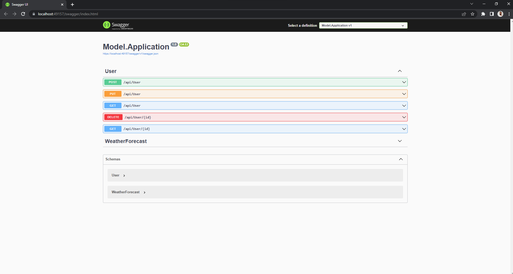

<p align="center">
    <h3>Application with a simple CRUD to pratice the concepts layer architecture (DDD) about.</h3>  
</p>

<p align="center">
  <a href="https://github.com/WellingtonFidelis">
    
  </a>

  

  

  
</p>

<p align="center">
  
</p>

# :pushpin: Tabela de conteúdos

* [Sobre o projeto](#satisfied-sobre-o-projeto)
* [Layout](#panda_face-layout)
* [Tecnologias](#snowflake-tecnologias)
* [Como rodar o projeto](#question-como-rodar-o-projeto)
* [Autor](#closed_book-autor)

---
# :satisfied: Sobre o projeto
This project was made to study the layer architecture Domain Driven Design (DDD), CSharp (C#) and the software MS Visual Studio.
Acknowledgments to [Alex Alves](https://github.com/alexalvess) to share your learning at this subject.

---
# :panda_face: Layout
* [Swashbuckle.AspNetCore](https://www.nuget.org/packages/Swashbuckle.AspNetCore/6.2.3?_src=template)

---
# :snowflake: Tecnologias
* [C#](https://docs.microsoft.com/pt-br/dotnet/csharp/)
* [FluentValidation.AspNetCore](https://www.nuget.org/packages/FluentValidation.AspNetCore/11.2.1?_src=template)
* [Microsoft.EntityFrameworkCore.Design](https://www.nuget.org/packages/Microsoft.EntityFrameworkCore.Design/6.0.8?_src=template)
* [Microsoft.EntityFrameworkCore.Tools](https://www.nuget.org/packages/Microsoft.EntityFrameworkCore.Tools/6.0.8?_src=template)
* [MySqlConnector](https://www.nuget.org/packages/MySqlConnector/2.1.13?_src=template)
* [Pomelo.EntityFrameworkCore.MySql](https://www.nuget.org/packages/Pomelo.EntityFrameworkCore.MySql/6.0.2?_src=template)
* [Microsoft.VisualStudio.Azure.Containers.Tools.Targets](https://www.nuget.org/packages/Microsoft.VisualStudio.Azure.Containers.Tools.Targets/1.17.0?_src=template)
* [Docker](https://www.docker.com/)

---
# :question: Como rodar o projeto
## Acessando direto pelo site:
* Ainda não consegui deixar online. =/

## Rodando na máquina local:
> Certifique-se de ter instalado na sua máquina o [Docker](https://www.docker.com/).

1. Abra o terminal na pasta desejada para clonar o repositório e execute o comando:
``` bash
git clone https://github.com/WellingtonFidelis/CrudMySqlEntityFrameworkCore.git
```
2. Depois de concluído, abra a pasta Model:
``` bash
cd CrudMySqlEntityFrameworkCore/Model
```
3. Clique com o botão direito no arquivo "Model.sln" e escolha a opção de abrir no Visual Studio
4. Certifique-se que a opção de executar o projeto está selecionado "Docker"
5. Clicar em Run com Docker e aguardar o projeto ser executado.

---
# :closed_book: Autor
Feito por [Wellington Fidelis](https://github.com/WellingtonFidelis).
### :octocat: Github: https://github.com/WellingtonFidelis
### :link: LinkedIn: https://www.linkedin.com/in/wellington-fidelis-7b02b167/
### :camera: Instagram: https://www.instagram.com/wellingtonfidelis/